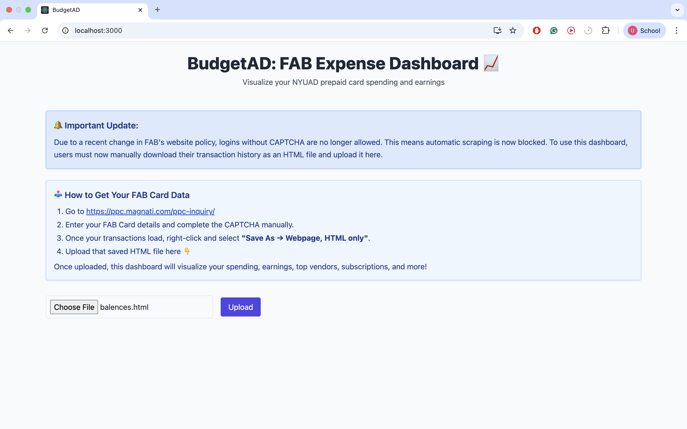
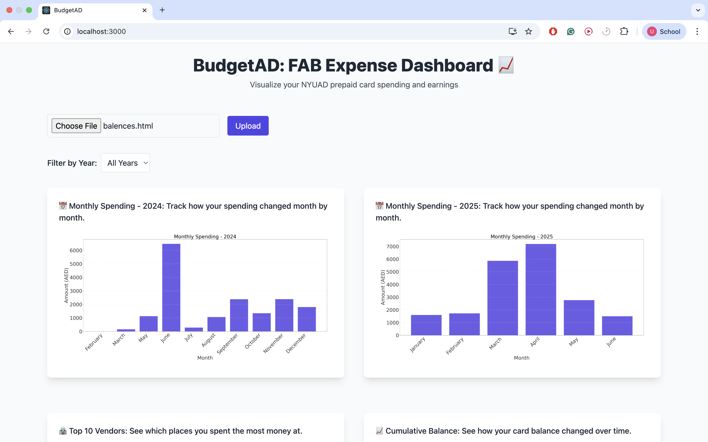
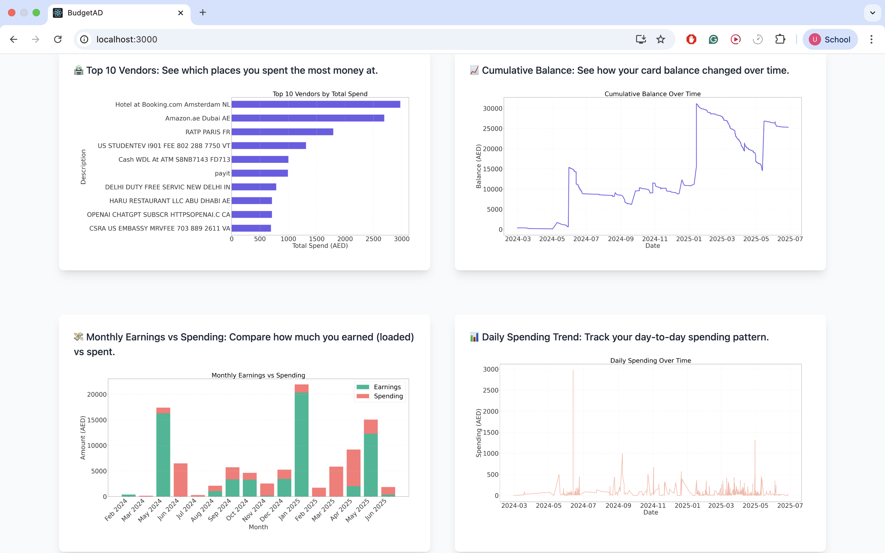

# 💳 BudgetAD: FAB Expense Dashboard 📊
A web-based dashboard to help **NYUAD students** (and anyone with a FAB prepaid card) **understand and visualize their spending and earnings** from their FAB card.

---

## ✨ Why I Built This
Apps like Payit are often buggy, unreliable, and fail to give clear breakdowns of your card activity.  
Even the official FAB inquiry portal just gives you a long, unstructured list of transactions.  
It's hard to spot trends, track balances, or identify recurring charges (like subscriptions or memberships).  

👉 **So I built this dashboard!**  

With this tool, you can upload your FAB card transaction history and get **beautiful, interactive charts** showing:
- Your monthly spending
- Your top vendors
- Your monthly earnings vs spend
- Your balance trends over time
- Potential subscriptions you didn't realize you had


---

## 📸 Screenshots

### Upload Interface

*Clean, simple interface for uploading your FAB transaction HTML file*

### Dashboard Views

*Interactive charts showing spending patterns over time* 

 
*Visual breakdown of your top spending categories and vendors*

---

## 📢 Important Update (June 2025)
🔐 **Due to a recent website policy change**, FAB now requires CAPTCHA during login.  
**This means automatic scraping is no longer possible.**

To use this dashboard:
1. Log in manually at:  
👉 [https://ppc.magnati.com/ppc-inquiry/](https://ppc.magnati.com/ppc-inquiry/)
2. Complete the CAPTCHA and enter your FAB card details.
3. After your transactions load, right-click and select:  
👉 **Save As → Webpage, HTML Only**
4. Upload the saved `.html` file into this dashboard.


---

## 🚀 Features
✅ Year-wise Monthly Spending  
✅ Top 10 Vendors by Total Spend  
✅ Cumulative Balance Graph  
✅ Earnings vs Spending Comparison  
✅ Daily Spending Trends  
✅ Subscription Detection (Based on same-day recurring charges 3+ times)  
✅ Year Filter Dropdown  

---

## 🛠️ Tech Stack
- Frontend: **React + Tailwind CSS**
- Backend: **Flask + Python (pandas + matplotlib)**
- Data Input: HTML export from FAB prepaid card inquiry portal

---

## ⚙️ Running Locally (Dev Mode)
1. **Backend:**
  ```bash
  cd backend
  python -m venv venv
  source venv/bin/activate
  pip install -r requirements.txt
  python app.py
```
2. **Frontend:**
  ```cd frontend
npm install
npm start
```


